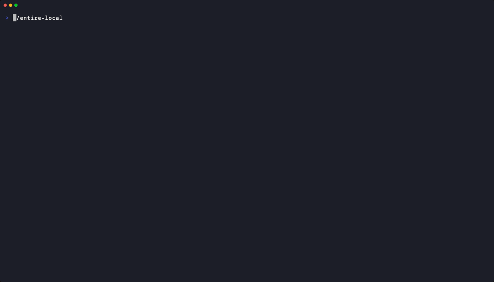
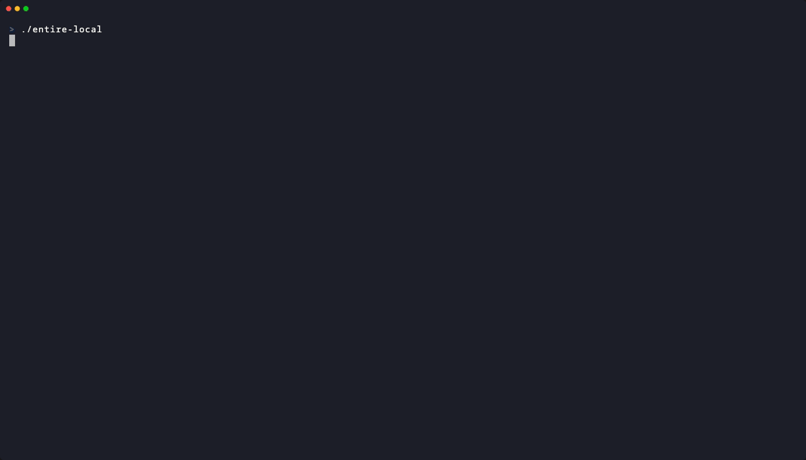
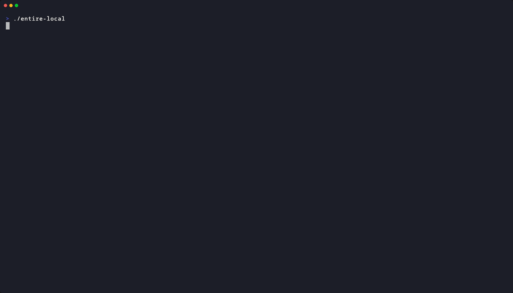

# entire-local

[](https://github.com/jcleira/entire-local/actions/workflows/ci.yml)
[](https://goreportcard.com/report/github.com/jcleira/entire-local)
[](https://pkg.go.dev/github.com/jcleira/entire-local)
[](LICENSE)

A terminal UI for browsing [entire.io](https://entire.io) checkpoints locally. Zero network, zero auth -- just git.


## Why

entire.io stores checkpoint data in a local git orphan branch. The web dashboard requires granting read access to your GitHub repos. **entire-local** is a local-first alternative that reads that data directly from your repo, keeping everything offline and private.

## Prerequisites

- **Go 1.24+**
- **git**
- A repository with [entire.io](https://entire.io) enabled (the orphan branch must exist locally)

## Installation

```bash
go install github.com/jcleira/entire-local@latest
```

Or build from source:

```bash
git clone https://github.com/jcleira/entire-local.git
cd entire-local
make install
```

## Usage

Navigate to any git repository with entire.io enabled and run:

```bash
entire-local
```

### Screens

- **Overview** -- Aggregated stats across all checkpoints: total sessions, token usage, and duration breakdown.
- **Checkpoint List** -- Browse and filter all checkpoints by prompt text. Press `/` to search.
- **Checkpoint Detail** -- Drill into a single checkpoint with three tabs:
  - **Transcript** -- Full conversation with syntax-highlighted code blocks.
  - **Files** -- Diff view showing all file changes with syntax highlighting.
  - **Plan** -- Rendered markdown plan for the session.

### Keyboard Shortcuts

| Key | Action |
|---|---|
| `j/k` | Navigate / scroll |
| `Enter/l` | Select checkpoint |
| `Esc/h` | Go back |
| `/` | Filter checkpoints |
| `Tab` | Next tab (detail view) |
| `Shift+Tab` | Previous tab |
| `1-3` | Jump to tab |
| `a` | Actions menu |
| `r` | Refresh data |
| `?` | Toggle help |
| `q` | Quit |

### Actions

Press `a` to open the action menu. This shells out to the `entire` CLI binary, so it must be in your PATH.

| Key | Command | Description |
|---|---|---|
| `s` | Status | Show entire.io state |
| `e` | Explain | AI analysis of checkpoint* |
| `d` | Doctor | Diagnose stuck sessions |
| `w` | Rewind | Rewind to checkpoint* |
| `m` | Resume | Resume session on branch* |
| `x` | Reset | Delete session state |
| `c` | Clean | Remove orphaned data |

*Requires a checkpoint selected. Destructive commands (Rewind, Resume, Reset, Clean) prompt for y/n confirmation before executing.

#### Demos

##### Menu

The front door. Press `a` from any screen and the action overlay slides in with every command one keypress away. Checkpoint-specific actions light up only when you have one selected. Everything funnels through here.


##### Status

The quick health check. Runs `entire status --detailed` and captures the output right in the TUI. No terminal switching, just read and scroll. The one command you'll run ten times a day without thinking about it.


##### Explain

AI-powered deep dive. Select a checkpoint and hit `e` to get an analysis of what happened during that session. Hands the checkpoint ID to `entire explain` and drops you into the full output. Best used when a diff alone doesn't tell the whole story.



##### Doctor

The fixer. When a session gets stuck mid-flight, `entire doctor` figures out why and tells you what to do about it. Runs inline so you can scan the diagnosis without leaving your checkpoint list.



##### Rewind

Time travel. Select a checkpoint, confirm with `y`, and `entire rewind --to <id>` rolls your working tree back to that exact point. Destructive by design -- the confirmation gate is there for a reason.



##### Resume

Pick up where you left off. Select a checkpoint, confirm, and `entire resume` drops you onto that session's branch ready to keep working. Another destructive action behind a `y/n` gate because switching branches mid-flow can surprise you.


##### Reset

The nuclear option for session state. Wipes entire's tracking data so you can start fresh. No checkpoint needed, just conviction and a `y` keypress. Use it when doctor says "just reset" or when you know exactly what you're doing.


##### Clean

Garbage collection. Sweeps out orphaned data that accumulates over time -- dead references, leftover blobs, the usual. Destructive enough to earn a confirmation prompt, gentle enough to run whenever things feel sluggish.


## Project Layout

```
cmd/                          Cobra command (root)
pkg/git/
  git.go                      ExecGit, RepoRoot, BranchExists
  reader.go                   Reader (ls-tree, show)
pkg/checkpoint/
  types.go                    Checkpoint & session types
  loader.go                   Loader (walks orphan branch tree)
  jsonl.go                    JSONL parser, flexTimestamp
  stats.go                    Token/duration stats
pkg/ui/
  commands/
    messages.go               PrintError/PrintInfo helpers
  dashboard/
    dashboard.go              Bubble Tea model, Init, Update, View
    actions.go                Action menu overlay (entire CLI)
    confirm.go                Destructive action confirmation
    command_output.go         Captured command output overlay
    keys.go                   Key bindings
    messages.go               Msg types
    styles.go                 Lipgloss styles
    overview.go               Overview screen
    checkpoint_list.go        Checkpoint list screen
    checkpoint_detail.go      Checkpoint detail (Files, Plan tabs)
    transcript.go             Transcript tab
    markdown.go               Markdown renderer
    help.go                   Help screen
```

## Development

```bash
make build     # Build binary
make test      # Run tests
make lint      # Run golangci-lint
make check     # fmt + vet + lint
make deps      # Download & tidy dependencies
make demo      # Record all demo GIFs (requires vhs)
make demo-menu # Record a single demo GIF
```

See [CONTRIBUTING.md](CONTRIBUTING.md) for guidelines.

## License

[MIT](LICENSE)
